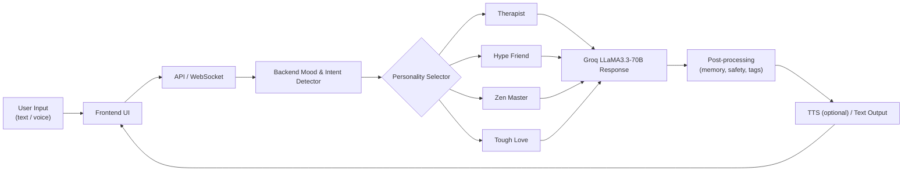
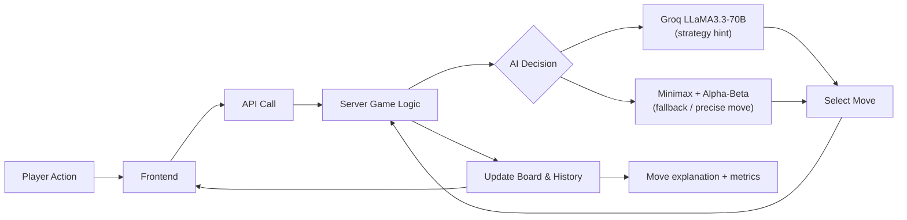
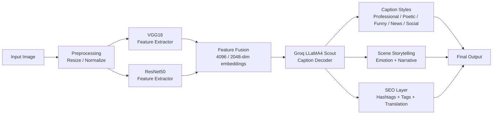
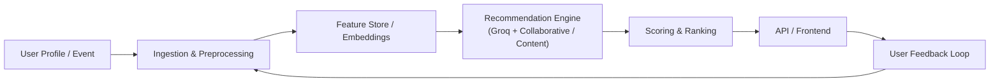
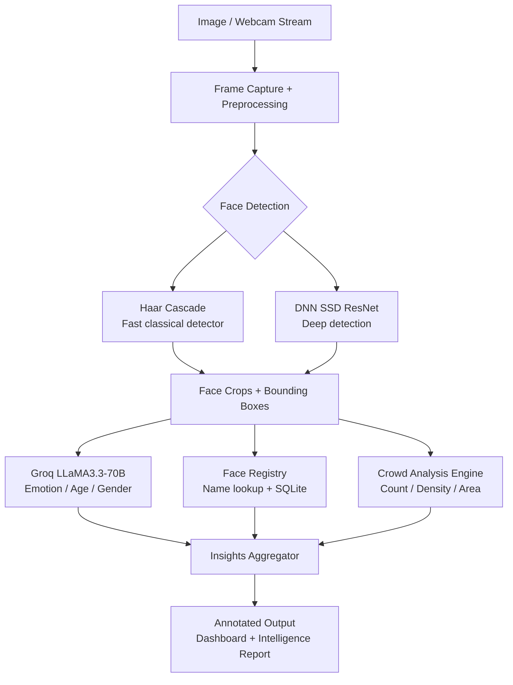

div align="center">


<br/>


<br/>

> **CodSoft AI Internship — May Batch C2 2026** — All 5 tasks completed with modern full-stack architecture, powered by **Groq LLaMA3.3-70B**, featuring unique UI/UX, patent-worthy innovations, sound effects, and novelties far beyond the basic requirements.

<br/>

[📋 Tasks](#-tasks) · [🚀 Getting Started](#-getting-started) · [🛠️ Tech Stack](#%EF%B8%8F-tech-stack) · [👨‍💻 Author](#-author)

</div>

---

## 📋 Tasks

<div align="center">

| # | Task | Tech | Status |
|---|---|---|---|
| 1 | **MoodBot** — Adaptive Emotional Resonance Chatbot | React + Node.js + Groq | ✅ Completed |
| 2 | **Tic-Tac-Toe AI** — Groq LLaMA3 powered game | React + Node.js + Groq | ✅ Completed |
| 3 | **CaptionVerse** — VGG16/ResNet50 + Transformer captioning | Python + Flask + PyTorch + Groq | ✅ Completed |
| 4 | **UniRec** — Universal AI Recommendation Engine | React + Python + Flask + Groq | ✅ Completed |
| 5 | **FaceVerse** — Haar + DNN Face Detection & Recognition | Python + Flask + OpenCV + Groq | ✅ Completed |

</div>

---

## ✅ Task 1 — MoodBot AI Chatbot

<table>
<tr>
<td width="50%">

### Features
- 🧠 **Adaptive Emotional Resonance Engine** — patent-worthy
- 😊 **Real-time mood detection** — keyword pattern matching
- 🔄 **Auto personality switching** — if-else rule system
- 🧘 **4 AI Personalities** — Therapist, Hype Friend, Zen Master, Tough Love
- 🌍 **Auto language detection** — English, Tamil, Hindi
- 🎤 **Voice input + TTS output** — Web Speech API
- 📜 **Full conversation memory**
- 📊 **Mood journey + summary**

</td>
<td width="50%">

### Pipeline


### Architecture
```text
Task1-Chatbot/
├── backend/
│   ├── server.js       # Express + Groq SDK
│   ├── package.json
│   └── .env
├── frontend/
│   ├── src/
│   │   ├── App.jsx
│   │   └── App.css
│   └── vite.config.js
└── README.md
```

</td>
</tr>
</table>

### Run Task 1
```bash
cd Task1-Chatbot/backend && npm install && node server.js   # :5001
cd Task1-Chatbot/frontend && npm install && npm run dev     # :3001
```

---

## ✅ Task 2 — Tic-Tac-Toe AI

<table>
<tr>
<td width="50%">

### Features
- 🤖 **Groq LLaMA3** as the AI brain
- 🎯 **4 Difficulty levels** — Easy, Medium, Hard, Unbeatable
- 🧠 **4 AI Personalities** — Strategic, Aggressive, Defensive, Chaotic
- 📐 **4 Grid sizes** — 3×3, 4×4, 5×5, 6×6
- ⏱️ **Move timer** — pressure mode
- 🏆 **Match mode** — First to 3/5/7 wins
- 🔊 **Sound effects** — Web Audio API
- 💡 **AI reasoning** — explains every move

</td>
<td width="50%">

### Pipeline


### Architecture
```text
Task2-TicTacToe-AI/
├── backend/
│   ├── server.js       # Express + Groq + Minimax
│   ├── package.json
│   └── .env
├── frontend/
│   ├── src/
│   │   ├── App.jsx
│   │   └── App.css
│   └── vite.config.js
└── README.md
```

</td>
</tr>
</table>

### Run Task 2
```bash
cd Task2-TicTacToe-AI/backend && npm install && node server.js   # :5000
cd Task2-TicTacToe-AI/frontend && npm install && npm run dev     # :3000
```

---

## ✅ Task 3 — CaptionVerse Image Captioning

<table>
<tr>
<td width="50%">

### Features
- 🖼️ **VGG16** — 138M param CNN feature extractor
- 🖼️ **ResNet50** — 25M param residual CNN extractor
- 🤖 **Groq LLaMA4 Scout** — Transformer caption decoder
- 📝 **5 Caption styles** — Professional, Poetic, Funny, News, Social
- 🎭 **Emotion detection** — confidence score
- 📖 **Scene storytelling** — 3-sentence narrative
- 🔍 **Object detection** — with confidence bars
- 🌍 **7 language translation**
- 🏷️ **12 hashtags + 8 SEO tags**

</td>
<td width="50%">

### Pipeline


</td>
</tr>
</table>
 
### Architecture
```text
Task3-Image-Captioning/captionverse/
├── backend/
│   ├── app.py              # Flask + PyTorch (ResNet50/BLIP) + decoder (Flan-T5 / Groq)
│   ├── requirements.txt    # Python dependencies
│   ├── .env                # GROQ_API_KEY, model overrides
│   ├── models/             # saved encoders / checkpoint (optional)
│   └── test_images/        # sample images
├── frontend/
│   ├── index.html
│   ├── package.json
│   ├── vite.config.js
│   └── src/
│       ├── App.jsx
│       ├── CaptionApp.jsx
│       ├── main.jsx
│       ├── App.css
│       └── index.css
└── README.md
```

### Run Task 3
```bash
cd Task3-Image-Captioning/backend
pip install -r requirements.txt
python app.py                          # :5003

cd Task3-Image-Captioning/frontend
npm install && npm run dev             # :3003
```

---

## ✅ Task 4 — UniRec Universal AI Recommendation Engine

<table>
<tr>
<td width="50%">

### Features
- 🌍 **8 Categories** — Movies, Music, Books, Games, Food, Fitness, Travel, Apps
- 🧬 **Emotional DNA Fingerprint** — unique preference profile
- 🔗 **Cross-Category Resonance** — connects dots across categories
- 🗺️ **Mood-to-Universe Mapping** — 8 moods × 8 categories
- 🔐 **Login / Register** — bcrypt auth + sessions
- ⭐ **Rate & Save** — 5-star ratings + favourites
- 🔍 **Universal search** — find anything
- 📱 **Real links** — IMDb, Spotify, Goodreads, Steam

</td>
<td width="50%">

### Pipeline


### Architecture
```text
Task4-Recommendation-System/
├── backend/
│   ├── app.py          # Flask + Groq + SQLite
│   ├── requirements.txt
│   └── .env
├── frontend/
│   ├── src/
│   │   ├── App.jsx
│   │   ├── Auth.jsx
│   │   └── api.js
│   └── vite.config.js
└── README.md
```

</td>
</tr>
</table>

### Run Task 4
```bash
cd Task4-Recommendation-System/backend
pip install -r requirements.txt
python app.py                          # :5002

cd Task4-Recommendation-System/frontend
npm install && npm run dev             # :3002
```

---

## ✅ Task 5 — FaceVerse Facial Intelligence Engine

<table>
<tr>
<td width="50%">

### Features
- 🔍 **Haar Cascade** — OpenCV classic face detector
- 🧠 **DNN SSD ResNet** — Deep learning face detector
- 😊 **Emotion recognition** — 7 emotions per face via Groq
- 👤 **Age & gender estimation** — per face with confidence
- 👥 **Crowd analysis** — count + density + area metric
- 🎥 **Live webcam** — real-time detection stream
- 🏷️ **Face registry** — register names + SQLite storage
- 📊 **Detection history** — stats dashboard
- 🖼️ **Annotated output** — bounding boxes drawn on image

</td>
<td width="50%">

### Pipeline


</td>
</tr>
</table>
 
### Architecture
```text
Task5-Face-Detection/faceverse/
├── backend/
│   ├── app.py                  # Flask + OpenCV + Groq inference hooks
│   ├── requirements.txt
│   ├── models/
│   │   ├── deploy.prototxt
│   │   └── res10_300x300_ssd_iter_140000.caffemodel
│   ├── .env
│   └── recordings/             # optional saved frames / history
├── frontend/
│   ├── index.html
│   ├── package.json
│   ├── vite.config.js
│   └── src/
│       ├── App.jsx
│       ├── main.jsx
│       ├── App.css
│       └── index.css
└── README.md
```

### Run Task 5
```bash
cd Task5-Face-Detection/backend
pip install -r requirements.txt
python app.py                          # :5004

cd Task5-Face-Detection/frontend
npm install && npm run dev             # :3004
```

---

## 🚀 Getting Started

### Prerequisites
- Node.js 18+
- Python 3.10+
- Free [Groq API key](https://console.groq.com) — no credit card needed

### Clone the repo
```bash
git clone https://github.com/dharani25007-code/CODSOFT.git
cd CODSOFT
```

---

## 🛠️ Tech Stack

<div align="center">

| Layer | Technology | Used in |
|---|---|---|
| **Frontend** | React 18 + Vite 5 | Tasks 1, 2, 3, 4, 5 |
| **Backend** | Node.js + Express | Tasks 1, 2 |
| **Backend** | Python 3.10 + Flask | Tasks 3, 4, 5 |
| **AI Model** | Groq LLaMA3.3-70B | Tasks 1, 2, 4, 5 |
| **Vision AI** | Groq LLaMA4 Scout | Task 3 |
| **CNN Models** | VGG16 + ResNet50 (PyTorch) | Task 3 |
| **Face Detector** | Haar Cascade + DNN SSD ResNet | Task 5 |
| **Fallback AI** | Minimax + Alpha-Beta Pruning | Task 2 |
| **Database** | SQLite | Tasks 4, 5 |
| **Auth** | Flask-Bcrypt + Sessions | Task 4 |
| **CV Library** | OpenCV 4.10 | Task 5 |
| **Styling** | Pure CSS (custom dark theme) | All tasks |
| **Audio** | Web Audio API | Tasks 1, 2 |
| **Voice** | Web Speech API | Task 1 |

</div>

---

## 📄 License

MIT License — free to use and modify.

---

## 👨‍💻 Author

<div align="center">


### Dharanidharan M

*CodSoft AI Intern — May Batch C2 2026*

[](https://www.linkedin.com/in/dharani-dharan-m-370083376/)
[](https://github.com/dharani25007-code)

</div>

---

<div align="center">

**All 5 tasks completed — CodSoft AI Internship ✦**


</div>
