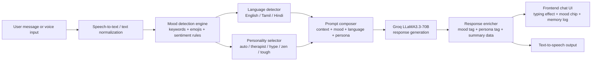

<div align="center">


<br/>


<br/>

> **MoodBot** is an AI-powered mental health companion that goes far beyond a rule-based chatbot. It detects your emotional state in real time, tracks your mood journey across the entire conversation, auto-switches its personality to match what you need, replies in your language, and speaks back to you — all powered by **Groq LLaMA3.3-70B**, completely free.

<br/>

[✨ Features](#-features) · [🧠 Innovation](#-the-innovation) · [🏗️ Architecture](#%EF%B8%8F-architecture) · [🔌 API](#-api-endpoints) · [🚀 Setup](#-getting-started) · [👨‍💻 Author](#-author)

</div>

---

## ✨ Features

<table>
<tr>
<td width="50%">

### 🧠 Adaptive Emotional Resonance Engine
- Real-time mood detection from every message
- Tracks full mood trajectory across session
- Mood journey visualization (emoji trail)
- Auto-switches AI personality based on emotion
- End-of-session compassionate mood summary

</td>
<td width="50%">

### 🤖 4 AI Personalities
- 🧘 **Calm Therapist** — Warm, empathetic, validating
- 🔥 **Hype Friend** — Energetic, casual, motivating
- ☯️ **Zen Master** — Wise, philosophical, calming
- 💪 **Tough Love** — Direct, firm, action-oriented
- 🤖 **Auto** — AI picks best personality for your mood

</td>
</tr>
<tr>
<td width="50%">

### 🎙️ Voice I/O
- 🎤 Voice input via Web Speech API
- 🔈 Text-to-speech AI reply output
- Auto language detection — English / Tamil / Hindi
- AI always replies in the user's own language

</td>
<td width="50%">

### 💬 Chat Experience
- Full conversation memory (context window)
- Character-by-character typing animation
- Sound effects — send, receive, mood shift
- Quick-start suggestion chips on welcome screen
- Per-message mood indicator + persona label
- Message timestamps

</td>
</tr>
</table>

---

## 🧠 The Innovation

> ### Adaptive Emotional Resonance Engine

Traditional chatbots respond to **keywords**. MoodBot responds to **emotions**.

| Feature | Traditional Chatbot | MoodBot |
|---|---|---|
| Input understanding | Keyword matching | Emotion detection |
| Personality | Fixed | Dynamically adapts |
| Memory | None | Full session context |
| Language | English only | English / Tamil / Hindi |
| Voice | None | Input + Output |
| Mood tracking | None | Full journey + summary |

**How it works:**
1. Every message is analyzed for emotional signals (words + emojis)
2. Mood is classified → happy / sad / angry / anxious / stressed / neutral
3. Mood trajectory is tracked across the entire session
4. AI personality auto-switches to what the user needs most
5. System prompt adapts dynamically — the AI is always "in character" for your emotion
6. Session ends with a compassionate insight summary

---

## 🔄 Pipeline



## 🏗️ Architecture

```
Task1-Chatbot/
│
├── 🟢 backend/
│   ├── server.js              # Express API + Groq SDK
│   │                          # Mood detection engine
│   │                          # Language detector
│   │                          # Personality system
│   │                          # Memory via chat history
│   ├── package.json
│   └── .env                   # GROQ_API_KEY (gitignored)
│
├── ⚛️  frontend/
│   ├── src/
│   │   ├── App.jsx            # Full chat UI
│   │   │                      # Voice I/O engine
│   │   │                      # Sound effects engine
│   │   │                      # Typing animation
│   │   │                      # Mood summary modal
│   │   ├── App.css            # Glassmorphism dark UI
│   │   ├── main.jsx           # React entry point
│   │   └── index.css          # Global styles + animations
│   ├── index.html
│   ├── vite.config.js         # Proxy → backend :5001
│   └── package.json
│
├── .gitignore                 # .env excluded
└── README.md
```

---

## 🔌 API Endpoints

| Method | Endpoint | Description |
|:---:|---|---|
| `GET`  | `/health` | Backend status + model info |
| `POST` | `/api/chat` | Send message → AI reply with mood + persona |
| `POST` | `/api/mood-summary` | Get compassionate session summary |

### POST `/api/chat`

**Request:**
```json
{
  "message": "I'm really stressed about my exams",
  "history": [
    { "role": "user", "content": "hi" },
    { "role": "assistant", "content": "Hey! How are you feeling today?" }
  ],
  "personalityId": "auto",
  "sessionMoods": ["neutral"]
}
```

**Response:**
```json
{
  "reply": "Exam stress is real and valid. Let's break this down together — what feels most overwhelming right now?",
  "mood": "stressed",
  "language": "English",
  "personalityId": "tough",
  "personalityName": "Tough Love",
  "personalityEmoji": "💪",
  "allMoods": ["neutral", "stressed"]
}
```

### POST `/api/mood-summary`

**Request:**
```json
{
  "history": [...],
  "allMoods": ["neutral", "anxious", "stressed", "neutral"]
}
```

**Response:**
```json
{
  "summary": "You started feeling uncertain but worked through your anxiety with honesty and courage. Every step you take, no matter how small, is progress worth celebrating."
}
```

---

## 🎭 Mood Detection

MoodBot detects 6 emotional states from text + emojis:

| Mood | Color | Trigger words / emojis |
|---|---|---|
| 😊 Happy | `#fbbf24` | happy, excited, amazing, joy, 😄 🎉 |
| 😢 Sad | `#60a5fa` | sad, cry, lonely, hopeless, 😭 💔 |
| 😠 Angry | `#f87171` | angry, frustrated, hate, rage, 😤 🤬 |
| 😰 Anxious | `#a78bfa` | anxious, nervous, scared, panic, 😨 😟 |
| 😩 Stressed | `#fb923c` | stressed, tired, burnout, deadline, 😫 |
| 😐 Neutral | `#6ee7b7` | everything else |

---

## 🌍 Language Support

MoodBot auto-detects and replies in:

| Language | Detection | Script |
|---|---|---|
| English | Default | Latin |
| Tamil | Unicode range `\u0B80–\u0BFF` | Tamil script |
| Hindi | Unicode range `\u0900–\u097F` | Devanagari |

**Example:**
- You type: `நான் மிகவும் சோர்வாக இருக்கிறேன்`
- MoodBot replies in Tamil automatically ✅

---

## 🚀 Getting Started

### Prerequisites
- Node.js 18+
- Free [Groq API key](https://console.groq.com) — no credit card needed

### 1. Clone the repo
```bash
git clone https://github.com/dharani25007-code/CODSOFT.git
cd CODSOFT/Task1-Chatbot
```

### 2. Backend setup
```bash
cd backend
npm install
```

Create `.env`:
```env
GROQ_API_KEY=your_groq_api_key_here
GROQ_MODEL=llama-3.3-70b-versatile
PORT=5001
```

Start backend:
```bash
node server.js
# ✅ Running at http://localhost:5001
```

### 3. Frontend setup
```bash
cd frontend
npm install
npm run dev
# ✅ Running at http://localhost:3001
```

> Open two terminals — both must run simultaneously.

### 4. Get your free Groq API key
1. Go to [console.groq.com](https://console.groq.com)
2. Sign up free — no credit card needed
3. **API Keys** → **Create API Key**
4. Paste into `backend/.env`

---

## 🛠️ Tech Stack

<div align="center">

| Layer | Technology | Purpose |
|---|---|---|
| **Frontend** | React 18 + Vite 5 | Chat UI + state management |
| **Backend** | Node.js + Express 4 | REST API server |
| **AI Model** | Groq LLaMA3.3-70B | Conversation + mood reasoning |
| **Voice Input** | Web Speech API | Browser-native mic — zero cost |
| **Voice Output** | SpeechSynthesis API | Browser-native TTS — zero cost |
| **Sound FX** | Web Audio API | Beep engine — zero cost |
| **Styling** | Pure CSS | Glassmorphism dark design system |

</div>

---

## 📸 Demo Prompts

Try these to see all features in action:

```
😰  "I'm scared about my future and don't know what to do"
😊  "I just got selected for an internship! I'm so excited!"
😩  "I'm so stressed, I have 3 deadlines tomorrow"
😢  "I feel like nobody understands me"
🌀  Switch to Tough Love → "I keep procrastinating and failing"
🌍  Tamil → "நான் மிகவும் சோர்வாக இருக்கிறேன்"
📊  After 5 messages → click Mood Summary
```

---

## 📄 License

MIT License — free to use and modify.

---

## 👨‍💻 Author

<div align="center">


### Dharanidharan M

*CodSoft AI Intern — May Batch C2 2026*

[](https://www.linkedin.com/in/dharani-dharan-m-370083376/)
[](https://github.com/dharani25007-code)

</div>

---

<div align="center">

**CodSoft AI Internship — Task 1 ✦**


</div>