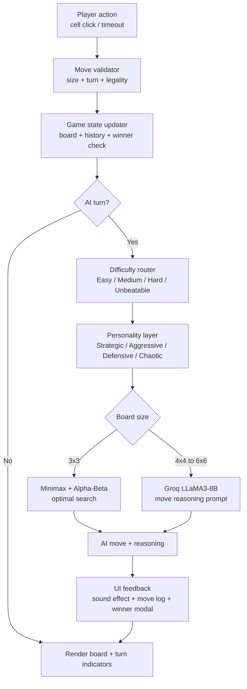

<div align="center">


<br/>

[](https://git.io/typing-svg)

<br/>


<br/>

> A full-stack Tic-Tac-Toe game where the AI opponent is powered by **Groq LLaMA3-8B** — it reads the board, reasons about the best move, and explains its strategy in plain English. Features 4 grid sizes, 4 difficulty levels, 4 AI personalities, move timer, match mode, and sound effects.

<br/>

</div>

---

## ✨ Features

<table>
<tr>
<td width="50%">

### 🤖 AI Engine
- **Groq LLaMA3-8B** as the AI brain
- AI explains every move in plain English
- **Minimax + Alpha-Beta Pruning** fallback
- Groq runs silently — no toggle exposed to user

</td>
<td width="50%">

### 🎮 Game Modes
- **4 Grid sizes** — 3×3, 4×4, 5×5, 6×6
- **Match mode** — First to 3 / 5 / 7 wins
- **Move timer** — 5s / 10s / 15s / 20s
- Auto-plays random move on timeout

</td>
</tr>
<tr>
<td width="50%">

### 🧠 AI Personalities
- 🧠 **Strategic** — Balanced, optimal play
- ⚔️ **Aggressive** — Always attacks first
- 🛡️ **Defensive** — Always blocks first
- 🎲 **Chaotic** — Unpredictable moves

</td>
<td width="50%">

### 🎯 Difficulty Levels
- 🟢 **Easy** — Random moves
- 🟡 **Medium** — 50% smart, 50% random
- 🔴 **Hard** — Heuristic + Groq
- 🟣 **Unbeatable** — Minimax / Groq optimal

</td>
</tr>
</table>

### More Novelties
- 🔊 **Sound effects** — place, AI move, win fanfare, lose, alarm via Web Audio API
- 📜 **Move history log** — color-coded per player
- 💡 **AI reasoning** — shows why AI picked its move
- ⚙️ **Settings panel** — gear icon reveals all options
- 🏆 **Match-over modal** — champion announcement
- 🟢 **Backend health indicator** — live status dot

---

## 🏗️ Architecture

```
Task2-TicTacToe-AI/
├── 🟢 backend/
│   ├── server.js          # Express API + Groq SDK + Minimax logic
│   ├── package.json
│   └── .env               # GROQ_API_KEY (gitignored)
│
├── ⚛️  frontend/
│   ├── src/
│   │   ├── App.jsx        # Full game logic + UI + sound engine
│   │   ├── App.css        # Dark theme design system
│   │   ├── api.js         # Backend service layer
│   │   ├── main.jsx       # React entry point
│   │   └── index.css      # Global styles + animations
│   ├── index.html
│   ├── vite.config.js     # Proxy → backend
│   └── package.json
│
├── .gitignore             # .env excluded
└── README.md
```

---

## 🔌 API Endpoints

| Method | Endpoint | Description |
|:---:|---|---|
| `GET` | `/health` | Backend health + model status |
| `POST` | `/api/ai-move` | Get AI move (Groq or Minimax) with reasoning |
| `POST` | `/api/game-state` | Check winner + winning cells |

### POST `/api/ai-move` — Request
```json
{
  "board": [null, "X", null, "O", null, null, null, null, null],
  "aiMark": "O",
  "humanMark": "X",
  "size": 3,
  "difficulty": "unbeatable",
  "personality": "strategic"
}
```

### POST `/api/ai-move` — Response
```json
{
  "move": 4,
  "reasoning": "Taking center maximizes winning lines on both diagonals.",
  "source": "groq-llama3"
}
```

---

## 🚀 Getting Started

### Prerequisites
- Node.js 18+
- Free [Groq API key](https://console.groq.com)

### 1. Clone the repo
```bash
git clone https://github.com/dharani25007-code/CODSOFT.git
cd CODSOFT/Task2-TicTacToe-AI
```

### 2. Backend
```bash
cd backend
npm install

# Create .env file
echo GROQ_API_KEY=your_key_here > .env
echo GROQ_MODEL=llama3-8b-8192 >> .env
echo PORT=5000 >> .env

node server.js
# ✅ Running at http://localhost:5000
```

### 3. Frontend
```bash
cd frontend
npm install
npm run dev
# ✅ Running at http://localhost:3000
```

> Both servers must run simultaneously. Open two terminals.

### 4. Get your free Groq API key
1. Go to [console.groq.com](https://console.groq.com)
2. Sign up free — no credit card needed
3. Go to **API Keys** → **Create API Key**
4. Paste into `backend/.env`

---

## 🛠️ Tech Stack

<div align="center">

| Layer | Technology | Purpose |
|---|---|---|
| **Frontend** | React 18 + Vite 5 | Game UI + state management |
| **Backend** | Node.js + Express 4 | REST API server |
| **AI Model** | Groq LLaMA3-8B | AI move reasoning |
| **Fallback** | Minimax + Alpha-Beta | Unbeatable 3×3 AI |
| **Styling** | Pure CSS | Custom dark design system |
| **Audio** | Web Audio API | Sound effects — zero cost |

</div>

---

## 🧠 Algorithm

Two AI engines work together:

**1. Groq LLaMA3** — sends board state as structured prompt → parses JSON response for move + reasoning. Used for larger grids (4×4, 5×5, 6×6) and personality-based play.

**2. Minimax + Alpha-Beta Pruning** — classic recursive game tree search. Evaluates every possible outcome. Used for unbeatable 3×3 mode. Pruning reduces complexity from O(b^d) to near O(b^(d/2)).

---

## 🔄 Pipeline



---


*CodSoft AI Intern — May Batch C2 2026*

[](https://www.linkedin.com/in/dharani-dharan-m-370083376/)
[](https://github.com/dharani25007-code)

</div>

---

<div align="center">

**CodSoft AI Internship — Task 2 ✦**


</div>