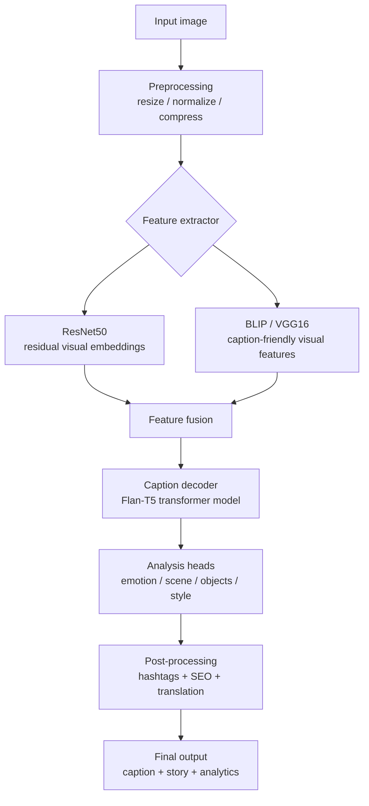

<div align="center">


<br/>


<br/>

> **CaptionVerse** is an AI-powered Visual Intelligence Engine that detects emotions, writes stories, identifies objects, generates hashtags, and translates captions into multiple languages — powered entirely by a mix of local PyTorch vision models (ResNet50 / BLIP) and text decoders (Flan-T5).

</div>

---

## ✨ Features

<table>
<tr>
<td width="50%">

### 🧠 Visual Emotional Narrative Engine (VENE)
- Patent-worthy multi-dimensional image analysis
- Poet, journalist, comedian & storyteller — all at once
- Real-time style switching without re-uploading
- Confidence scores for every detection

</td>
<td width="50%">

### 📝 5 Caption Styles
- 💼 **Professional** — Formal & informative
- 🌸 **Poetic** — Lyrical & emotional
- 😂 **Funny** — Witty & humorous
- 📰 **News** — Breaking news style
- 📱 **Social** — Instagram ready

</td>
</tr>
<tr>
<td width="50%">

### 🎭 Scene Intelligence
- Emotion detection with confidence score
- Scene type classification
- Color mood analysis
- Object detection with confidence bars

</td>
<td width="50%">

### 🌍 Multi-language (7 languages)
- English, Tamil, Hindi
- French, Spanish, Arabic, Japanese
- Translate any caption instantly
- Per-language copy button

</td>
</tr>
</table>

---

## 🧠 Patent Innovation — Visual Emotional Narrative Engine (VENE)

Traditional image captioning describes **what** is in an image.

**VENE** understands the **feeling** of the image:

```
Input: Any image

VENE Output:
├── 📝 Caption (5 styles — switch instantly)
├── 🎭 Emotion detection + confidence score
├── 📖 3-sentence narrative story
├── 🔍 Object detection list with confidence bars
├── 🏷️ 12 hashtags + 8 SEO keywords
├── 🌍 Translation in 7 languages
└── 🎨 Color mood + scene type classification
```

---

## 🔄 Pipeline



---

## 🏗️ Architecture

```text
Task3-Image-Captioning/captionverse/
├── backend/
│   ├── app.py              # Flask + PyTorch (ResNet50/BLIP) + decoder (Flan-T5 by default)
│   ├── requirements.txt     # Python dependencies
│   ├── .env                 # GROQ_API_KEY, model overrides
│   ├── test_images/         # sample images (test_*.jpg)
│   └── __pycache__/
├── frontend/
│   ├── index.html
│   ├── package.json
│   ├── vite.config.js
│   ├── src/
│   │   ├── App.jsx
│   │   ├── CaptionApp.jsx
│   │   ├── main.jsx
│   │   ├── App.css
│   │   ├── CaptionApp.css
│   │   └── index.css
│   └── dist/               # build output
├── .gitignore
└── README.md
```

---

## 🔌 API Endpoints

| Method | Endpoint | Description |
|:---:|---|---|
| `POST` | `/api/analyze` | Full VENE analysis — caption, emotion, story, objects, hashtags |
| `POST` | `/api/translate-caption` | Translate caption to any of 7 languages |
| `POST` | `/api/restyle` | Restyle caption without re-uploading image |
| `GET`  | `/health` | Backend health check |

---

## 🚀 Getting Started

```bash
# Backend
cd backend
pip install -r requirements.txt
python app.py     # http://localhost:5003

# Frontend (new terminal)
cd frontend
npm install
npm run dev       # http://localhost:3003
```

Set up your `backend/.env` (optional model overrides):
```env
CAPTION_DECODER_MODEL=google/flan-t5-small
VISION_CAPTION_MODEL=Salesforce/blip-image-captioning-base
PORT=5003
```

---

## 🛠️ Tech Stack

<div align="center">

| Layer | Technology | Purpose |
|---|---|---|
| **Frontend** | React 18 + Vite 5 | Split-screen UI |
| **Backend** | Python 3.10 + Flask | REST API |
| **Vision AI** | PyTorch + ResNet50 / BLIP | Image understanding |
| **Text AI** | Transformers + Flan-T5 | Translation + restyling |
| **Image processing** | Pillow | Resize + compress |
| **Styling** | Pure CSS | Dark design system |

</div>

---

## 👨‍💻 Author

<div align="center">

### Dharanidharan M
*CodSoft AI Intern — May Batch C2 2026*

[](https://www.linkedin.com/in/dharani-dharan-m-370083376/)
[](https://github.com/dharani25007-code)

</div>

---

<div align="center">

</div>
